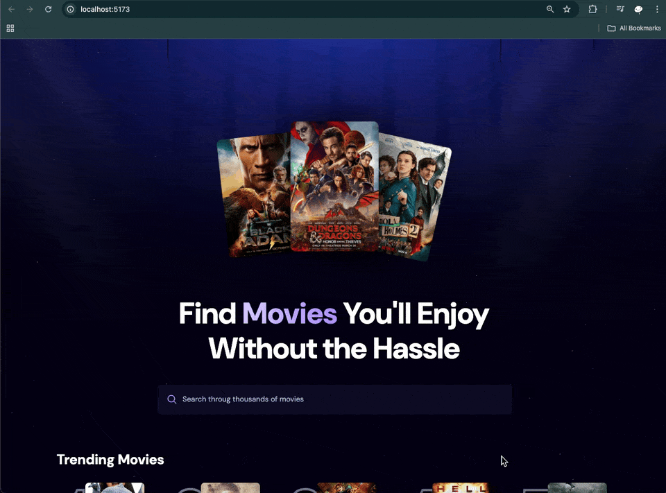

<h3 align="center">Trending Movies App</h3>

<a href="#">
  
</a>

## ⚠️ Note

This project was implemented based on a tutorial video on YouTube from JS Mastery [React JS 19 Full Course 2025 | Build an App and Master React in 2 Hours](https://www.youtube.com/watch?v=dCLhUialKPQ).

## Table of Contents

1. [Introduction](#introduction)
2. [Demo](#demo)
3. [Tech Stack](#tech-stack)
4. [Features](#features)
5. [Quick Start](#quick-start)
6. [What I learned](#learn)
7. [Missing Features](#miss)

## <a name="introduction">Introduction</a>

Movie search app that allows users to search for movies and that search history will use to update the trending movies section.

## <a name="demo">Demo</a>

### Search Movie

<a href="">
  
</a>

## <a name="tech-stack">Tech Stack</a>

- Vite - as a build tool and create a project
- React v19 - as a framework
- Tailwind CSS v4 - as a CSS framework
- Appwrite - as a Database service
- TMDB - as a Movie Database service

## <a name="features">Features</a>

### Features of the Trending Movies App

- Search movie
- Trending movies

## <a name="quick-start">Quick Start</a>

Follow these steps to set up the project locally on your machine.

**Prerequisites**

- Git
- Node.js
- npm

**Cloning the Repository**

```bash
git clone https://github.com/bank8426/try-react-tailwind-vite.git
cd try-react-tailwind-vite
```

**Installation**

Install the project dependencies using npm:

```bash
npm install
```

**Set Up Environment Variables**

1. Create a new file named `.env.local` and copy content inside `.env.example`
2. Replace the placeholder values with your actual credentials

```env
# https://www.themoviedb.org/settings/api
VITE_TMDB_API_KEY=

# https://cloud.appwrite.io/
VITE_APPWRITE_PROJECT_ID=
# it chage based on server region
VITE_APPWRITE_ENDPOINT=
VITE_APPWRITE_DATABASE_ID=
# create movies collection in database
VITE_APPWRITE_COLLECTION_ID=
```

**Running the Project**

```bash
npm run dev
```

Open [http://localhost:5173](http://localhost:5173/) in your browser to view the project.

## <a name="learn">What I learned</a>

- `Appwrite` is a database service.

  - It offer free tier with maximum at 2 projects and 1 database per project. But you can create multiple collections in the database. It doesn't have `ORM` command. But has their own `Query` class to help generate query string.

- `TMDB API` is a movie database service that has a free API to get movie and TV show.

- `react-use` is a library that provides a lot of hooks to use in React. But we use only `useDebounce` hook in this project to help prevent the search function from being called too often.

## <a name="miss">Missing Features</a>

- Pagination for movie list
- Movie detail page
